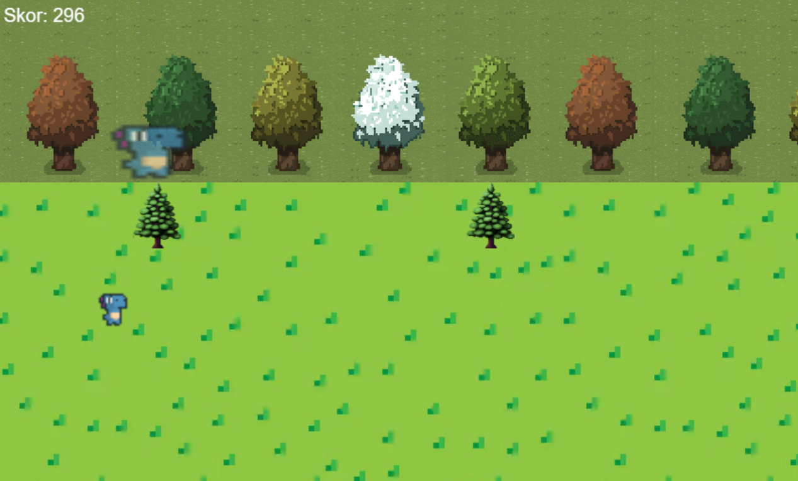
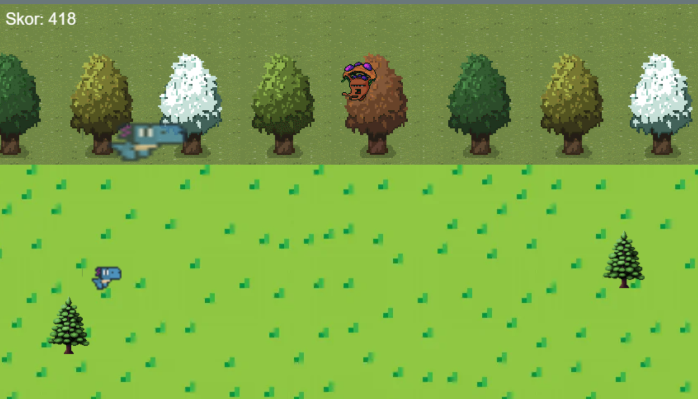
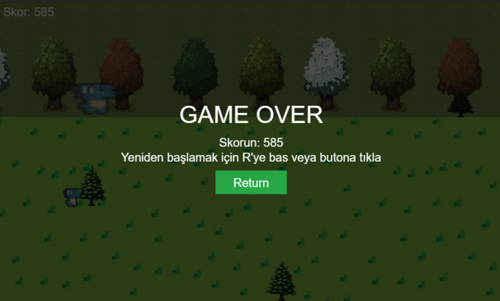

# selinsenturkk.github.io
# Gecko Runner

Gecko Runner; JavaScript, HTML ve CSS kullanılarak geliştirilen sonsuz bir koşu (infinite runner) oyunudur. Oyunda bir gecko karakterini kontrol eder, engellerden kaçmaya çalışırsınız. Zıplayabilir, yukarı/aşağı hareket edebilir ve aynı zamanda kendi gölgenize gelen engellerden de kaçarak yüksek skor elde etmeye çalışırsınız.

ORIJINAL OYUNUN LİNKİ: https://sealestial-games.itch.io/gecko-runner

---

## Oynanış

- Gecko karakterini kontrol ederek engellerden kaçmaya çalışın.
- Giderek zorlaşan bir oyun temposuyla, reflekslerinizi test edin.
- Yerdeki, uçan ve gölge engellerden kaçın. Yüksek skor yapın.

OYUNU OYNAMAK İÇİN: https://selinsenturkk.github.io/

---

## Kontroller
çok basit!
W: yukarı çık
S: Aşağı in
Space: Zıpla
R: Yeniden başla

---

## Ekran Görüntüsü

---
## Oyunun videosu 
Youtube linki: https://www.youtube.com/watch?v=kKH5UWXTpmg 

## Sesler ve Grafikler

- Oyundaki karakter, düşmanlar, zemin ve arka plan görselleri `/images/` klasöründe yer almaktadır.
- Zıplama, yenilme ve bonus sesleri ise `/sounds/` klasöründe yer almaktadır.

---

